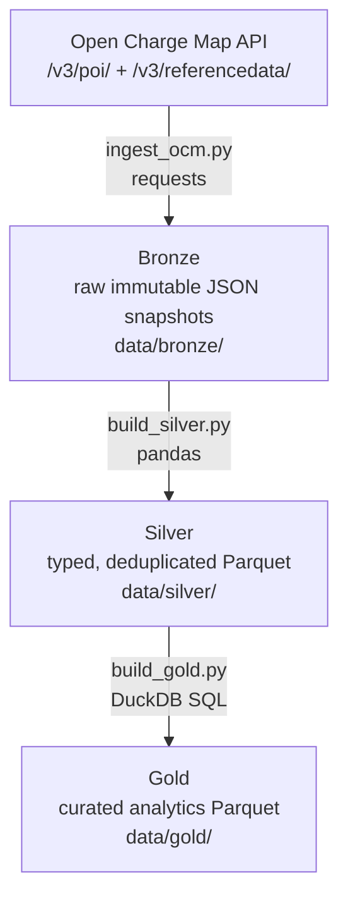

# ⚡ Bangalore EV Charging Data Platform

A medallion-architecture data pipeline for Bangalore's public EV charging network — raw API ingestion through curated analytics tables, built with Python, pandas, and DuckDB. All data bounded to the Bangalore bounding box (12.83–13.14°N, 77.35–77.75°E).

## Architecture



| Layer | Format | Contents |
|---|---|---|
| **Bronze** | JSON | Raw API responses, append-only, timestamped snapshots + reference/lookup data |
| **Silver** | Parquet | `stations` (152 rows) and `connections` (266 rows) — typed, deduplicated, provenance-tracked |
| **Gold** | Parquet | `fast_charger_coverage`, `power_tier_distribution`, `connector_mix` |

## Key findings

From the 2026-08-31 snapshot (152 stations, 266 connectors, via Open Charge Map):

- **54.6% of stations are fast chargers (≥50 kW)** — 30.3% standard (11–49 kW), 13.2% slow (<11 kW), 2% unknown
- **CCS (Type 2) dominates the connector mix**: 173 of 266 connectors (65%), followed by IEC 60309 3-pin (30) and tethered Type 2 (29); CHAdeMO is fading (10), GB/T present (6)
- **Fast-charging leadership**: Statiq 21/25 stations fast, JIO BP Pulse 19/19 (100%), Shell Recharge 16/19 — while Tata Power skews slow (5/22 fast)
- **Data gaps, quantified**: 30 stations (20%) have no known operator, 15 connectors (5.6%) have unknown type, 3 stations lack power data

> **Data provenance**: All data comes from [Open Charge Map](https://openchargemap.org) (ODbL license), filtered to the Bangalore bounding box. This reflects what OCM's community-fed database contains — not an official or complete registry of Bangalore's charging network.

## How to run

Prerequisites: Python 3.11+, a free [OCM API key](https://openchargemap.org/site/develop/api).

```powershell
# 1. Clone and set up
git clone <repo-url>
cd EV_charging_project
python -m venv .venv
.venv\Scripts\activate          # PowerShell; use .venv\Scripts\activate.bat for cmd
pip install -r requirements.txt

# 2. Set your API key (PowerShell syntax)
$env:OCM_API_KEY = "your-key-here"
# cmd syntax:      set OCM_API_KEY=your-key-here

# 3. Run the full pipeline (ingest -> silver -> gold, stops on first failure)
.venv\Scripts\python.exe src\run_pipeline.py

# Or run stages individually:
.venv\Scripts\python.exe src\ingest_ocm.py    # API -> Bronze
.venv\Scripts\python.exe src\build_silver.py  # Bronze -> Silver
.venv\Scripts\python.exe src\build_gold.py    # Silver -> Gold
```

**Windows note**: set `PYTHONUTF8=1` if console output fails with a `UnicodeEncodeError` (connector names contain non-ASCII characters).

## Project structure

```text
EV_charging_project/
├── src/
│   ├── ingest_ocm.py     # OCM API -> Bronze (stations + reference data)
│   ├── build_silver.py   # Bronze -> Silver (clean, type, dedup, join, provenance)
│   ├── build_gold.py     # Silver -> Gold (DuckDB analytics queries)
│   └── run_pipeline.py   # runs all three stages in order, stops on failure
├── data/
│   ├── bronze/           # raw JSON snapshots (gitignored)
│   ├── silver/           # typed Parquet tables (gitignored)
│   └── gold/             # analytics Parquet tables (gitignored)
├── design_notes/
│   └── silver_schema.md  # Silver schema design + rationale
├── requirements.txt      # requests, pandas, pyarrow, duckdb
└── README.md
```

## Data quality decisions

Choices that shaped the pipeline, each learned from real data:

- **Bounding box enforced in our code, not the API's.** The OCM `boundingbox` query parameter proved unreliable (returned a broken record at coordinates (0,0)). The pipeline queries by radius (30 km around Bangalore center), then applies a strict client-side bbox filter — Bangalore-only scope is a guarantee in our code.
- **Geography from coordinates, never from text.** The `Town` field takes 7+ values for the same city (`Bengaluru`, `Bangalore`, missing, one US template value `Bowie`). All geographic logic uses lat/lon.
- **Nulls are preserved, never faked.** Missing `PowerKW` stays null — filling with 0 would corrupt averages; filling with a mean would be fabrication. Unknown operators surface as "(Unknown Operator)" via the reference-data join.
- **Provenance on every Silver row.** `source_file` and `loaded_at_utc` columns trace each row to the Bronze snapshot it came from.
- **Dedup rule**: if a `station_id` appears twice in a snapshot, the row with the latest `DateLastStatusUpdate` wins.

See [design_notes/silver_schema.md](design_notes/silver_schema.md) for the full schema rationale.

## Roadmap

Deliberately scoped — each tool is added only when the current pipeline's pain justifies it:

1. **Runner script** — one command for the full pipeline (before any orchestrator)
2. **Serving layer** — expose Gold tables to downstream analytics/ML projects
3. **Object storage (MinIO)** — replace local `data/` directories
4. **Orchestration (Airflow)** — scheduled refreshes
5. **Transformations (dbt)** — replace hand-written Silver/Gold SQL
6. **Streaming, CI/CD, monitoring** — synthetic session simulator, Kafka/Spark, GitHub Actions
